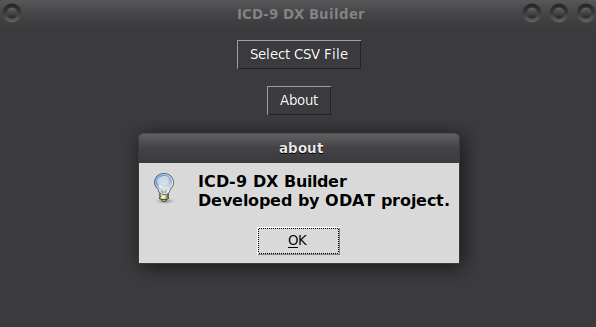

# Tool 6

This GUI application lets you create a full dx events based on ICD9 codes for large number of diseases for HA raw dx data.

## Description

[Visit odat.info](https://odat.info)

## Screenshot

